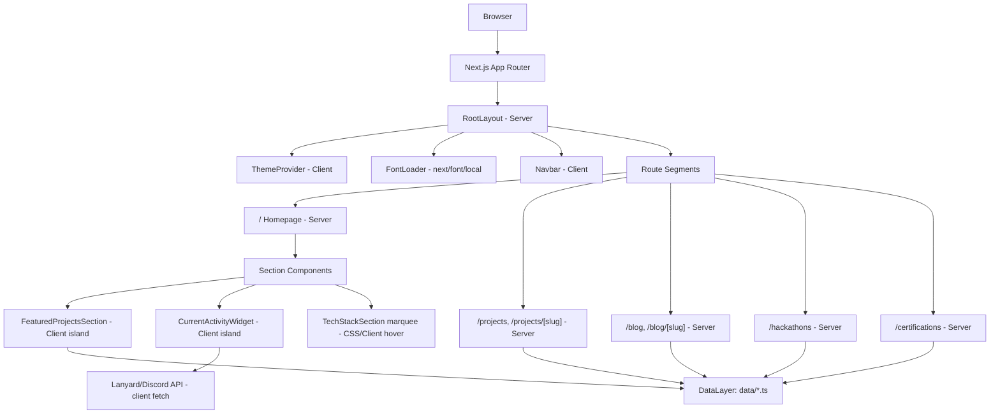
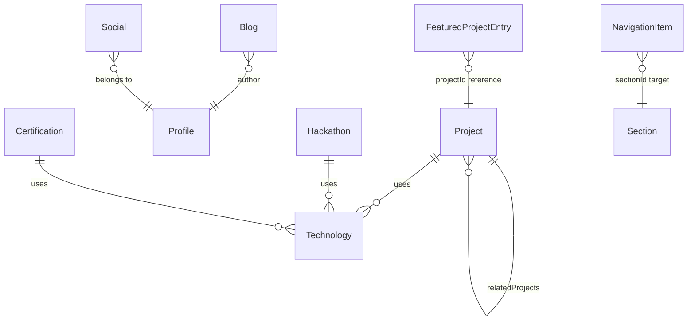

# Design Document

## Overview

Developer Portfolio v2 is a homepage-first, data-driven personal portfolio built on the Next.js App Router. The homepage (`/`) is the primary surface: a long, single-scroll experience composed of ten ordered sections (Hero, Featured Projects, Latest Blogs, Tech Stack, Certifications, Competitive Programming, Hackathons, Education, Contact, Footer). The Navbar never changes routes from the homepage — it only smooth-scrolls between sections. Six dedicated routes (`/projects`, `/projects/[slug]`, `/blog`, `/blog/[slug]`, `/hackathons`, `/certifications`) exist purely for expanded browsing and are reached exclusively through "Explore More" buttons or in-card links.

Two architectural themes run through every design decision below:

1. **Data-driven, zero-duplication content.** Every visible string, image, link, and badge originates from a typed file under `data/`. Homepage previews and dedicated pages read from the _same_ dataset — a preview is a slice of the full dataset, never a separate copy.
2. **Server-first rendering.** Components are Server Components by default. Client Components are isolated to the smallest possible leaf nodes that require interactivity: the Navbar (scroll spy, drawer, theme toggle), the FeaturedProjectsSection selector, the CurrentActivityWidget (live fetch), the TechStack marquee (hover pause), the ThemeProvider, and section reveal wrappers (viewport observation for animation).

The one explicit deviation from the Docs suite is typography: **Instagram Sans** replaces Geist/Inter as the primary font family. Because Instagram Sans is not published as a `next/font/google` font, it is self-hosted and loaded via `next/font/local`, exposed only through a CSS variable token — no component ever references the font-family string directly.

### Key Design Decisions

| Decision                                                                                                                                          | Rationale                                                                                                                                                                                                                                                                                                                            |
| ------------------------------------------------------------------------------------------------------------------------------------------------- | ------------------------------------------------------------------------------------------------------------------------------------------------------------------------------------------------------------------------------------------------------------------------------------------------------------------------------------ |
| `next/font/local` for Instagram Sans, CSS variable token (`--font-sans`)                                                                          | Requirement 2 mandates self-hosting since Instagram Sans isn't a Google font; a token indirection lets the font be swapped later without touching components.                                                                                                                                                                        |
| `next-themes` with `suppressHydrationWarning` + inline blocking script                                                                            | Requirement 3.4 forbids theme flash; this is the standard no-flash pattern for App Router.                                                                                                                                                                                                                                           |
| Featured Projects selection state modeled as a single atomic object (`{ project, videoId, status }`) rather than independent `useState` calls     | Requirement 9.5/9.6 require atomic, all-or-nothing UI updates with revert-on-failure; a single state transition (reducer) guarantees consumers never observe a torn state.                                                                                                                                                           |
| CSS-driven marquee (`@keyframes translateX` via Tailwind + a duplicated track) rather than a JS animation loop                                    | Requirement 11.4/11.8/24.6 require a seamless, performant infinite loop; CSS transforms run off the main thread and trivially pause via `animation-play-state: paused` on `:hover`, with `prefers-reduced-motion` handled by disabling the animation in CSS media query — no JS needed for the base case.                            |
| Data layer as plain typed TS modules (no Zod at runtime, TS `satisfies` for compile-time validation)                                              | Requirements 4.x call for typed local data files; Coding_Standards/Tech_Stack recommend Zod as _optional_ validation — this design includes a lightweight build-time validation script (Requirement 4 relationships: relatedProjects/featuredProjects must resolve) instead of a runtime dependency, keeping the bundle server-only. |
| CurrentActivityWidget as a small Client Component performing a single client fetch to a Lanyard endpoint, with static fallback baked in from data | Requirement 8.6 requires it to be a Client Component only when it fetches; Requirement 8.3/8.4 require graceful, silent fallback.                                                                                                                                                                                                    |
| Explore More pattern enforced structurally, not just by convention                                                                                | Requirement 17.3 restricts homepage routing controls; every preview Section component accepts a single optional `exploreMoreHref` prop rendered by a shared `<ExploreMoreButton>`, so no section can accidentally add a second routing control.                                                                                      |

## Architecture

### High-Level System Diagram



### Folder Structure

Per Coding_Standards.md / Tech_Stack.md / Structure.md, extended with the specifics this feature needs:

```text
app/
  layout.tsx                  # RootLayout: html/body, font vars, ThemeProvider, Navbar, Footer slot
  page.tsx                    # Homepage: composes all sections (Server Component)
  error.tsx                   # Root error boundary
  not-found.tsx                # Root 404
  sitemap.ts                   # generates sitemap.xml
  robots.ts                    # generates robots.txt
  projects/
    page.tsx                   # ProjectsPage (Server, reads searchParams)
    error.tsx
    not-found.tsx
    [slug]/
      page.tsx                 # ProjectDetailPage (generateStaticParams + generateMetadata)
      not-found.tsx
  blog/
    page.tsx
    not-found.tsx
    [slug]/
      page.tsx
      not-found.tsx
  hackathons/
    page.tsx
    not-found.tsx
  certifications/
    page.tsx
    not-found.tsx

components/
  ui/                          # shadcn/ui primitives (button, dialog, tooltip, sheet, etc.)
  shared/
    Container.tsx
    Section.tsx
    SectionHeading.tsx
    ExploreMoreButton.tsx
    Badge.tsx
    Card.tsx
    RevealOnView.tsx           # Client: IntersectionObserver + framer-motion, animate-once
    EmptyState.tsx
    ErrorState.tsx
  navbar/
    Navbar.tsx                 # Client: sticky, blur-on-scroll, mobile drawer
    ActiveSectionIndicator.tsx # Client: IntersectionObserver-driven highlighting
    ThemeToggle.tsx             # Client
  hero/
    HeroSection.tsx
    Avatar.tsx
    SocialLinks.tsx
    CurrentActivityCard.tsx    # Client: fetch
    GitHubContributionCard.tsx
  featured-projects/
    FeaturedProjectsSection.tsx  # Server: fetches data, renders Client island below
    FeaturedProjectsClient.tsx   # Client: owns selection state (reducer)
    VideoPlayer.tsx              # Client: lazy iframe
    ProjectSelector.tsx
    ProjectDetails.tsx
  blog-preview/
    BlogPreviewSection.tsx
    BlogCard.tsx
  tech-stack/
    TechStackSection.tsx
    TechCategoryRow.tsx          # Client: hover pause; CSS marquee
    TechBadge.tsx
  certifications/
    CertificationsSection.tsx
    CertificationCard.tsx
  competitive-programming/
    CompetitiveProgrammingSection.tsx
    PlatformCard.tsx
  hackathons/
    HackathonsSection.tsx
    HackathonCard.tsx
  education/
    EducationSection.tsx
    EducationCard.tsx
  contact/
    ContactSection.tsx
    ContactCard.tsx
  footer/
    Footer.tsx
  projects-page/
    SearchBar.tsx               # Client
    FilterBar.tsx               # Client
    ProjectGrid.tsx
  project-detail/
    HeroBanner.tsx
    ScreenshotGallery.tsx
    FeatureList.tsx
    ArchitectureSection.tsx
    ChallengeSection.tsx
    RelatedProjects.tsx
  blog-page/
    BlogGrid.tsx
    CategoryFilter.tsx          # Client
  blog-article/
    TableOfContents.tsx
    ReadingProgress.tsx          # Client
    ShareButtons.tsx              # Client
    PrevNextNav.tsx

sections/                       # thin re-export barrel mapping Component_Specification names -> components/*
hooks/
  useActiveSection.ts
  useTheme.ts                    # thin wrapper over next-themes
  useCurrentActivity.ts
  usePrefersReducedMotion.ts
  useMediaQuery.ts
lib/
  seo.ts                         # generateMetadata helpers, JSON-LD builders
  data-access.ts                 # typed getters/selectors over data/*.ts (getFeaturedProjects, getProjectBySlug, ...)
  validate-data.ts                # build-time referential integrity checks (script)
  lanyard.ts                      # client fetch + response mapping
  fonts.ts                        # next/font/local config, exported className/variable
utils/
  cn.ts
  formatDate.ts
  readingTime.ts
types/
  project.ts
  blog.ts
  certification.ts
  hackathon.ts
  education.ts
  competitive-programming.ts
  technology.ts
  current-activity.ts
  navigation.ts
  profile.ts
  social.ts
  site.ts
  index.ts
data/
  profile.ts
  navigation.ts
  socials.ts
  projects.ts
  featured-projects.ts
  blogs.ts
  certifications.ts
  hackathons.ts
  education.ts
  competitive-programming.ts
  technologies.ts
  current-activity.ts
  site.ts
styles/
  globals.css                    # Tailwind layers + CSS variable tokens (color + font)
public/
  fonts/                          # Instagram Sans .woff2 files
  images/
```

### Server/Client Component Boundary

Following Requirement 1.9 and Coding_Standards §10, the rule applied throughout is: **push Client Components as far down the tree as possible.**

- `app/layout.tsx`, `app/page.tsx`, and every dedicated page's top-level `page.tsx` are Server Components. They fetch nothing async over the network — they import from `data/` synchronously and pass plain serializable props down.
- Client Components are declared with `"use client"` only in: `Navbar` (scroll + drawer + theme state), `ThemeProvider` wrapper, `CurrentActivityCard` (fetch + polling), `FeaturedProjectsClient` (selection reducer), `VideoPlayer` (lazy iframe mount via `IntersectionObserver`/`react-intersection-observer` or native `IntersectionObserver` in a hook), `TechCategoryRow` (hover pause is pure CSS but the reduced-motion check for JS-driven fallback lives here), `SearchBar`/`FilterBar`/`CategoryFilter` (controlled inputs), `ReadingProgress`, `ShareButtons`, `RevealOnView` (viewport-triggered Framer Motion), and `ThemeToggle`.
- Everything else (Cards, Badges, SectionHeading, Container, Footer, static section shells) remains a Server Component and receives already-resolved data as props.

## Components and Interfaces

### Component Hierarchy

```text
RootLayout (Server)
├── FontLoader (next/font/local, applied via className on <html>)
├── ThemeProvider (Client, next-themes)
├── Navbar (Client)
│   ├── ActiveSectionIndicator (Client, IntersectionObserver)
│   ├── ThemeToggle (Client)
│   └── MobileDrawer (Client, shadcn Sheet)
├── {children}  (page content)
└── Footer (Server)

Homepage (Server) — app/page.tsx
├── HeroSection (Server)
│   ├── Avatar (Server, next/image)
│   ├── SocialLinks (Server)
│   ├── GitHubContributionCard (Server, static image/embed)
│   └── CurrentActivityCard (Client)
├── FeaturedProjectsSection (Server, resolves data)
│   └── FeaturedProjectsClient (Client, owns selection state)
│       ├── VideoPlayer (Client, lazy iframe)
│       ├── ProjectSelector (Server-rendered list, Client onClick bubbles up)
│       └── ProjectDetails (Server-rendered, re-rendered by Client parent)
├── BlogPreviewSection (Server)
│   └── BlogCard[] (Server)
├── TechStackSection (Server)
│   └── TechCategoryRow[] (Client: hover/reduced-motion)
│       └── TechBadge[] (Server)
├── CertificationsSection (Server)
│   └── CertificationCard[] (Server)
├── CompetitiveProgrammingSection (Server)
│   └── PlatformCard[] (Server)
├── HackathonsSection (Server)
│   └── HackathonCard[] (Server)
├── EducationSection (Server)
│   └── EducationCard[] (Server)
├── ContactSection (Server)
│   └── ContactCard (Server)
└── (Footer rendered by RootLayout)

ProjectsPage (Server, reads searchParams)
├── SearchBar (Client)
├── FilterBar (Client)
└── ProjectGrid (Server)

ProjectDetailPage (Server)
├── HeroBanner
├── VideoPlayer (Client)
├── ScreenshotGallery
├── FeatureList
├── ArchitectureSection
├── ChallengeSection
└── RelatedProjects

BlogPage (Server)
├── CategoryFilter (Client)
└── BlogGrid (Server)

BlogArticlePage (Server)
├── TableOfContents
├── ReadingProgress (Client)
├── ShareButtons (Client)
└── PrevNextNav

HackathonsPage (Server) → HackathonCard[]
CertificationsPage (Server) → CertificationCard[]
```

### Shared Components (per Component_Specification.md §3)

- **Container** — `{ children, className? }`. Applies max-width (1280/1440px) and responsive horizontal padding.
- **Section** — `{ id, title, subtitle?, exploreMoreHref?, children }`. Wraps every homepage section, assigns the section's HTML `id` (Requirement 6.2), renders `SectionHeading`, and — only when `exploreMoreHref` is supplied — renders exactly one `ExploreMoreButton` (Requirement 17.1). Hero and Contact never pass `exploreMoreHref`.
- **SectionHeading** — `{ title, subtitle?, divider? }`.
- **ExploreMoreButton** — `{ href, label }`; the _only_ homepage component allowed to call `next/link` for cross-route navigation, structurally enforcing Requirement 17.3.
- **Button** — variants `primary | secondary | outline | ghost | link`; states default/hover/active/focus/disabled/loading, per Design_System §10.
- **Card** — variants `elevated | flat | interactive`; shared hover language (translateY(-2px), border emphasis, shadow increase — opacity/transform only, per Requirement 24.4).
- **Badge** — `{ icon?, label, color? }` used for technology tags.
- **EmptyState / ErrorState** — `{ title, message, action? }`; every dynamic section and dedicated page renders one of these instead of blank space (Requirement 28).
- **RevealOnView** — Client wrapper using `IntersectionObserver` (via a `useInView`-style hook) + Framer Motion `whileInView`/`animate` with `once: true`, so a section animates in exactly once (Requirement 24.3).

### Navbar

`Navbar` (Client) renders links from `data/navigation.ts` (Requirement 5, Requirement 4.13). Responsibilities:

- Sticky positioning; on scroll past a threshold, transitions `backdrop-blur` + background opacity + shadow (CSS transition, not JS-driven layout change).
- Delegates active-link detection to `ActiveSectionIndicator`, which uses one `IntersectionObserver` watching all section `<section id="...">` elements with a `rootMargin` tuned so the link updates promptly without visible lag (Requirement 5.5). Implementation detail: threshold array `[0, 0.25, 0.5, 0.75, 1]` and `rootMargin: "-45% 0px -45% 0px"` (a thin band near vertical center) so exactly one section is "most visible" at a time; the highlighted link is the last section whose observer entry crossed into that band, avoiding the classic multi-active-link bug.
- On a dedicated page, clicking a Navbar item that targets a homepage section calls `router.push("/#section-id")`; `HomePage`'s mount effect then scrolls to the hash target (Requirement 5.9).
- Below tablet breakpoint, links collapse into a `Sheet`-based drawer (shadcn/ui); selecting a link closes the drawer then scrolls (Requirement 5.6/5.7).
- Full keyboard operability: all links are real `<a>`/`<button>` elements; drawer close on `Escape` (shadcn Sheet default).

### HeroSection

Composes `Avatar`, name/role/bio (from `Profile`), `SocialLinks` (from `Social[]`), `GitHubContributionCard`, `CurrentActivityCard`. Two-column CSS grid at desktop, single column below `lg`. `SocialLinks` renders one button per known platform (GitHub, LinkedIn, X, Email, Resume); when a `Social` entry's `visible` is `false`, the button still renders in place but is disabled/muted rather than omitted (Requirement 7.5).

`CurrentActivityCard` (Client) is detailed under "CurrentActivityWidget Data-Fetching Design" below.

### FeaturedProjectsSection — Atomic Selection Design

This is the most stateful part of the homepage, so its design gets special attention against Requirements 9.5–9.9.

**Data resolution (Server):** `FeaturedProjectsSection` reads `featuredProjects` (ordered id references) from `data/featured-projects.ts`, resolves each id against `data/projects.ts` via `lib/data-access.ts#getProjectById`, and passes the resolved, ordered `Project[]` array as a plain prop into the Client island. No id-resolution logic ever runs in the browser.

**Client state model (`FeaturedProjectsClient`):** selection state is a single discriminated union, updated only through a reducer — never through independent `useState` calls per field — so partial/torn UI states are structurally impossible:

```ts
type SelectionState =
  | { status: "idle"; selectedIndex: number; project: Project }
  | {
      status: "transitioning";
      selectedIndex: number;
      project: Project;
      pendingIndex: number;
    }
  | { status: "error"; selectedIndex: number; project: Project };

type SelectionAction =
  | { type: "SELECT"; index: number }
  | { type: "COMMIT" } // all downstream consumers (video/details) confirmed ready
  | { type: "FAIL" }; // any consumer failed -> revert
```

Flow: clicking a `ProjectSelector` card dispatches `SELECT`. The reducer moves to `transitioning` but **keeps rendering the previous `project` and `selectedIndex`** until a `COMMIT` is dispatched; `VideoPlayer`, `ProjectDetails`, and the technology badge list are all derived from the _same_ `project` field in state, so they can never disagree about which project is displayed (Requirement 9.5's "atomically" requirement is satisfied by construction: there is exactly one source of truth object, not N independently-updated fields). `VideoPlayer` signals `COMMIT` once its new iframe `src` has been assigned (assignment is synchronous/local, so in the common case `COMMIT` fires on the same tick); if iframe assignment throws (e.g., malformed video id) it dispatches `FAIL` instead, and the reducer discards the `pendingIndex`, remaining on the previously committed `project` (Requirement 9.6). Framer Motion cross-fades `ProjectDetails` content keyed by `project.id`, capped at 300ms (Requirement 9.9). No `router.push`/`window.location` call exists anywhere in this component (Requirement 9.8), and scroll position is untouched because the DOM subtree height is held constant via a min-height on the video container (Requirement 9.13).

**ProjectSelector** renders exactly the resolved featured list (any length, not hardcoded to 3 — Requirement 9.1) as cards with title, one-line description, GitHub/demo links, and an active-state indicator driven by `state.selectedIndex`.

**ProjectDetails** renders title/description/features/tech badges/links from `state.project`, plus one `ExploreMoreButton` to `/projects` (Requirement 9.11).

**VideoPlayer** mounts a placeholder (fixed-aspect-ratio box, no iframe) until an `IntersectionObserver` reports the section is near-viewport, then injects the YouTube iframe `src` (Requirement 9.10, 27.3). On mobile, layout order becomes video → horizontal selector → details → buttons (Requirement 9.12), implemented by CSS order utilities on the same DOM, not conditional rendering, to avoid duplicate DOM/SEO content.

### BlogPreviewSection

Server Component. Selector `getRecentPublishedBlogs(2, 3)` in `lib/data-access.ts` returns the 2–3 newest non-draft posts by `publishedDate`. Renders `BlogCard[]` + one `ExploreMoreButton` to `/blog`. If fewer than 2 published posts exist, renders `EmptyState` describing the partial state (Requirement 10.5); exactly 2 is treated as fully normal (Requirement 10.4 — no special-casing).

### TechStackSection — Marquee Design

Six `TechCategoryRow`s, one per fixed category (`Frontend, Backend, Database, DevOps, AI/ML, Web3`), each fed `technologies.filter(t => t.category === category)` (Requirement 11.1/11.2).

**Implementation approach:** each row renders its badge list **twice**, back-to-back, inside a flex container wider than the viewport; a CSS `@keyframes marquee { from { transform: translateX(0) } to { transform: translateX(-50%) } }` animation with `animation: marquee var(--marquee-duration) linear infinite` moves the doubled track exactly one badge-set width, so the loop point is invisible (Requirement 24.6). Direction alternates per row index via a CSS class swap (`animation-direction: reverse` or mirrored keyframes) — even rows scroll left, odd rows scroll right (Requirement 11.5). `TechCategoryRow` is a Client Component only to attach `onMouseEnter/onMouseLeave` handlers that toggle `animation-play-state: paused` (Requirement 11.6); the animation itself is pure CSS so it never triggers React re-renders or layout thrash, satisfying the opacity/transform-only rule (Requirement 24.4) since `translateX` is a transform. `overflow: hidden` plus `white-space: nowrap`/`flex-nowrap` on the track guarantees badges never wrap at any breakpoint (Requirement 11.3/11.8) — narrower viewports change `--marquee-duration` (via a CSS custom property set per breakpoint) rather than the DOM layout, adjusting perceived speed without wrapping. When `prefers-reduced-motion: reduce` is detected (CSS media query `@media (prefers-reduced-motion: reduce) { animation-play-state: paused }`), the marquee is paused outright, satisfying Requirement 24.5 without any JS branching for the default no-preference case.

### CertificationsSection / CompetitiveProgrammingSection / HackathonsSection / EducationSection / ContactSection / Footer

All Server Components following the same pattern: a data-access selector resolves the relevant slice (`getFeaturedCertifications` falling back to non-featured per Requirement 12.1/12.2; static `platform` cards for LeetCode/Codeforces/CodeChef per Requirement 13; a preview slice of hackathons per Requirement 14; the full, date-ordered education list per Requirement 15; contact links/resume/CTA per Requirement 16), each rendered through the shared `Card`/`Badge`/`Section` components. `Footer` renders navigation + socials + copyright and is the final element of the homepage (Requirement 16.5), reused as-is (not re-fetched) on every dedicated page via `RootLayout`.

### Dedicated Page Components

- **ProjectsPage**: `SearchBar` (Client, debounced text input) + `FilterBar` (Client, category/status selects) manage filter state via `useState` + URL `searchParams` sync (so filters are shareable/refresh-safe per Requirement 22.3); `ProjectGrid` (Server) receives the already-filtered list computed in the Server Component from `searchParams` on each request/navigation. Empty-state and error-state per Requirement 18.6/18.7.
- **ProjectDetailPage**: `generateStaticParams` from all non-archived project slugs; `HeroBanner`, `VideoPlayer`, `ScreenshotGallery`, `FeatureList`, `ArchitectureSection`, `ChallengeSection`, `RelatedProjects` (resolved via `relatedProjects` ids); invalid slug triggers `notFound()` → `not-found.tsx` which still attempts to render 2–3 related/alternative projects (Requirement 19.5).
- **BlogPage** / **BlogArticlePage**: `CategoryFilter` (Client) over tags; article page renders `TableOfContents` (derived from content headings at build time), `ReadingProgress` (Client, scroll-based), `ShareButtons` (Client), `PrevNextNav` (computed from the full sorted blog list).
- **HackathonsPage** / **CertificationsPage**: simple Server-rendered full lists, no filtering required by requirements.

## Font Loading Strategy (Instagram Sans)

Per Requirement 2, addressed as follows:

1. **Files**: Instagram Sans `.woff2` weight files (400/500/600/700, whichever weights are licensed/available) are placed under `public/fonts/instagram-sans/`.
2. **Loader**: `lib/fonts.ts` uses `next/font/local`:

```ts
import localFont from "next/font/local";

export const instagramSans = localFont({
  src: [
    {
      path: "../public/fonts/instagram-sans/InstagramSans-Regular.woff2",
      weight: "400",
      style: "normal",
    },
    {
      path: "../public/fonts/instagram-sans/InstagramSans-Medium.woff2",
      weight: "500",
      style: "normal",
    },
    {
      path: "../public/fonts/instagram-sans/InstagramSans-SemiBold.woff2",
      weight: "600",
      style: "normal",
    },
    {
      path: "../public/fonts/instagram-sans/InstagramSans-Bold.woff2",
      weight: "700",
      style: "normal",
    },
  ],
  variable: "--font-sans",
  display: "swap", // Requirement 2.4
  fallback: ["system-ui", "-apple-system", "Segoe UI", "Roboto", "sans-serif"], // Requirement 2.2
});

export const monoFont = localFont({
  // or next/font/google if a licensed mono is used
  src: "../public/fonts/geist-mono/GeistMono-Regular.woff2",
  variable: "--font-mono",
  display: "swap",
});
```

3. **Application**: `app/layout.tsx` applies `className={cn(instagramSans.variable, monoFont.variable)}` on `<html>`. Both fonts expose CSS custom properties only — no component ever imports `instagramSans.className` directly to force text; instead:
4. **Tailwind mapping** (`tailwind.config.ts`): `theme.extend.fontFamily.sans = ["var(--font-sans)", "system-ui", "sans-serif"]` and `fontFamily.mono = ["var(--font-mono)", "monospace"]`. Every component uses Tailwind's `font-sans`/`font-mono` utility classes, which resolve through the token (Requirement 2.5 — no hardcoded "Instagram Sans" string anywhere in component code).
5. **Typography scale** (H1–H4, body, small, caption, code sizes from Design_System §5) is defined as Tailwind `fontSize` tokens, unaffected by the family swap (Requirement 2.7).

## Theme System Design

- **Library**: `next-themes`, per Tech_Stack §8.
- **Provider**: `components/theme/ThemeProvider.tsx` (Client) wraps children with `<NextThemesProvider attribute="class" defaultTheme="dark" enableSystem={false} storageKey="portfolio-theme">`. `enableSystem={false}` is deliberate: Requirement 3.2 mandates dark as the default on first visit regardless of OS preference, so system-preference auto-detection is disabled to avoid contradicting that rule; the visitor can still explicitly switch themes via `ThemeToggle`, and that explicit choice persists (Requirement 3.3).
- **No-flash strategy** (Requirement 3.4): `app/layout.tsx`'s `<html>` tag includes `suppressHydrationWarning`, and `next-themes` injects a small blocking inline script before hydration that reads `localStorage.getItem("portfolio-theme")` (defaulting to `"dark"`) and sets the `class` attribute on `<html>` synchronously — this is `next-themes`' built-in mechanism and requires no custom script.
- **Tokens**: all colors are CSS variables defined once in `styles/globals.css` under `:root` (dark values, since dark is default) and overridden under `.light` (or vice versa depending on next-themes convention), covering `--background --foreground --card --card-foreground --muted --muted-foreground --border --primary --secondary --accent --ring --shadow` (Design_System §7). Tailwind's `theme.extend.colors` maps each semantic name to `var(--token)`, so components use `bg-background`, `text-foreground`, etc. — never raw hex — and theme switching only ever mutates the `class` on `<html>`, requiring zero component-level changes (Requirement 3.6).
- **Toggle**: `ThemeToggle` (Client, in Navbar) calls `setTheme(theme === "dark" ? "light" : "dark")`, with an icon crossfade (200ms, per Animation_Guidelines §17).

## Routing Design

### Route Tree

```text
/                          Homepage (Server)
/projects                  ProjectsPage (Server)
/projects/[slug]           ProjectDetailPage (Server, generateStaticParams)
/blog                       BlogPage (Server)
/blog/[slug]                BlogArticlePage (Server, generateStaticParams)
/hackathons                 HackathonsPage (Server)
/certifications             CertificationsPage (Server)
/sitemap.xml                generated (app/sitemap.ts)
/robots.txt                 generated (app/robots.ts)
not-found (global + per-segment)
error (global + per-segment)
```

### Navbar Scroll-Only Pattern

Navbar link targets come from `data/navigation.ts` (`{ id, label, href, sectionId, order, visible }`). `href` for homepage-section links is always a hash (`#hero`, `#projects`, ...), matching the section `id`s mandated by Requirement 6.2. On the homepage, clicking such a link calls `element.scrollIntoView({ behavior: "smooth", block: "start" })` with a scroll-margin offset (`scroll-margin-top` CSS on each `<section>`) sized to the sticky Navbar height, so the target isn't hidden underneath it. `prefers-reduced-motion: reduce` degrades `behavior` to `"auto"` (instant jump).

### Explore More Pattern

Every preview `Section` that receives an `exploreMoreHref` renders exactly one `ExploreMoreButton` (a `next/link`), which is the _only_ sanctioned way a homepage control changes routes (Requirement 17). In-card links to detail pages (a project card's own link, a blog card's own link) are the other allowed exception called out explicitly in Requirement 17.3, and they exist only inside dedicated pages / project selector cards, not as extra homepage-preview-level controls.

### Scroll-to-Section from Dedicated Pages

When on a dedicated page (e.g. `/projects`) and a Navbar link targets a homepage section, the link's `href` becomes `/#${sectionId}`. Next.js performs a full navigation to `/`; on mount, `Homepage`'s effect checks `window.location.hash` and — if present — calls `scrollIntoView` on the matching section _after_ the initial paint (using `requestAnimationFrame` to ensure layout is settled), reproducing the smooth-scroll behavior even across a route change (Requirement 5.9).

### 404 and Not-Found Handling

- **Unknown routes**: the root `app/not-found.tsx` renders a friendly message + link home (Requirement 22.4).
- **Invalid `/projects/[slug]`**: the route calls `notFound()` inside `page.tsx` when `getProjectBySlug(slug)` returns `undefined`; `app/projects/[slug]/not-found.tsx` renders a "project not found" message and attempts `getRelatedOrPopularProjects()` as a fallback list, itself showing `EmptyState` if that list is also empty (Requirement 19.5, 28.4 — single message, not stacked messages).
- **Invalid/draft `/blog/[slug]`**: same pattern — draft posts are treated identically to non-existent slugs for the purposes of the not-found check (Requirement 20.6).
- **Runtime errors**: `error.tsx` boundaries (root + per dynamic segment) render a friendly message without exposing stack traces (Requirement 28.2), always including a Homepage link (Requirement 28.3).

### Browser Navigation and Deep Linking

Because every page is statically generated from `generateStaticParams` (or server-rendered on demand) and reads only from the local `data/` layer, direct URL access, refresh, and back/forward all resolve deterministically from the same data — there is no client-only state that back/forward could desync from (Requirement 22.1–22.3). If a dynamically generated route (e.g., a since-removed project slug) is no longer available, the same `not-found.tsx` fallback path is used, guaranteeing a navigable state rather than a broken page (Requirement 22.2).

## CurrentActivityWidget Data-Fetching Design

`CurrentActivityCard` is a Client Component (Requirement 8.6). Design:

1. **Initial render**: receives a `fallback: CurrentActivity` prop computed server-side from `data/current-activity.ts` (the static configured fallback, or an `"Offline"` default per Requirement 8.4) — so there is meaningful content in the very first paint with zero client JS executed yet, avoiding CLS.
2. **Client fetch**: on mount, `useCurrentActivity(fallbackData)` (a hook in `hooks/useCurrentActivity.ts`) calls `lib/lanyard.ts#fetchLanyardStatus(discordUserId)` against the public Lanyard REST endpoint (`https://api.lanyard.rest/v1/users/{id}`), wrapped in `try/catch` with a short timeout.
3. **Success**: maps the Lanyard payload (Spotify listening / VS Code activity / game activity / Discord status) to the `CurrentActivity` shape and replaces the displayed state — live data always wins over the static fallback while reachable (Requirement 8.2).
4. **Failure or not configured** (`discordUserId` env var absent, network error, non-200): the hook simply keeps rendering `fallbackData`; no error UI, toast, or console-visible-to-user error is shown (Requirement 8.3).
5. **Polling**: an optional `setInterval` (configurable, e.g. 60s) re-runs the fetch; cleaned up on unmount.
6. Icon/title/subtitle for whichever status is active are looked up from a status→presentation map (`Listening/Coding/Gaming/Idle/Offline` → icon + copy), satisfying Requirement 8.5.

This keeps the Server/Client boundary minimal: only this one card ships fetch logic to the browser; the rest of `HeroSection` stays server-rendered.

## SEO / Metadata Approach

- **Per-route metadata**: every `page.tsx` (homepage and all dedicated/detail routes) exports `generateMetadata` (dynamic routes) or a static `metadata` object (static routes), built through shared helpers in `lib/seo.ts` (`buildMetadata({ title, description, path, image? })`) so title/description/canonical/OG/Twitter are assembled consistently and never duplicated verbatim between two routes (Requirement 25.1–25.3). Detail routes (`/projects/[slug]`, `/blog/[slug]`) derive title/description/image directly from the entity's own `metaTitle`/`metaDescription`/`coverImage`/`heroImage` fields.
- **Sitemap/robots**: `app/sitemap.ts` iterates `data/projects.ts` (non-archived), `data/blogs.ts` (non-draft), `data/hackathons.ts`, `data/certifications.ts`, plus the four listing routes and homepage, emitting `MetadataRoute.Sitemap` entries; `app/robots.ts` allows all and points to the sitemap (Requirement 25.4).
- **JSON-LD**: a `<script type="application/ld+json">` is rendered server-side per route via small builder functions in `lib/seo.ts`: `personSchema(profile, socials)` on the homepage, `creativeWorkSchema(project)` (or `SoftwareSourceCode` when a GitHub link exists) on `ProjectDetailPage`, `blogPostingSchema(post)` on `BlogArticlePage`, and `breadcrumbListSchema(path segments)` on any dedicated page nested more than one level deep (`/projects/[slug]`, `/blog/[slug]`) (Requirement 25.5–25.6).
- **Images**: every `next/image` usage requires `alt`/`width`/`height` (or `fill` + explicit aspect-ratio container); purely decorative images pass `alt=""` (Requirement 25.7).

## Animation / Motion Implementation

Mapped directly onto Animation_Guidelines.md tokens:

- **Library**: Framer Motion for all React-driven animation (entrance, hover triggered via `whileHover`, state-change transitions); CSS transitions/keyframes for hover color/border changes and the marquee, per Requirement 24.1 and Animation_Guidelines §3 ("avoid mixing multiple animation libraries" is interpreted as: Framer Motion is the single library for anything requiring React state/lifecycle coupling; plain CSS handles stateless, always-on effects like marquee and simple hover transitions, which is also what Design_System/Animation_Guidelines themselves describe for hover states).
- **Timing tokens**: centralized in `lib/motion.ts` as constants `DURATION = { fast: 0.15, standard: 0.25, slow: 0.35 }` and `EASING = { out: [0.16, 1, 0.3, 1], inOut: "easeInOut" }` (Requirement 24.2), imported by every animated component rather than inlining raw numbers.
- **Scroll reveal**: `RevealOnView` uses Framer Motion `initial="hidden" whileInView="visible" viewport={{ once: true }}` with `variants = { hidden: { opacity: 0, y: 16 }, visible: { opacity: 1, y: 0 } }` — animating only `opacity`/`transform`, never `once: false`, satisfying Requirement 24.3/24.4.
- **Featured Projects transition**: `AnimatePresence mode="wait"` keyed by `project.id` around `ProjectDetails`, `transition={{ duration: DURATION.standard }}` (≤300ms per Requirement 9.9).
- **Reduced motion**: a single hook `usePrefersReducedMotion()` (wrapping `window.matchMedia("(prefers-reduced-motion: reduce)")`) is read by `RevealOnView` (skips the transform, keeps only an instant opacity change) and by any Framer Motion variant that includes stagger; Framer Motion's own `useReducedMotion` hook is used directly where convenient. The marquee's reduced-motion handling is pure CSS (`@media (prefers-reduced-motion: reduce)`), needing no JS branch. Critically, none of this changes default behavior for visitors without an explicit OS preference (Requirement 24.5).

## Error Handling and Empty States

Conventions (Requirement 28, Coding_Standards §12, SEO_Accessibility §17–18):

- **`error.tsx`** at root and at each dynamic segment (`projects/[slug]`, `blog/[slug]`) catches render-time exceptions, logs details via `console.error` (dev-only visibility) and renders `<ErrorState title="Something went wrong" message="..." action={<Link href="/">Back to Home</Link>} />` — never raw error messages or stack traces (28.2, 28.3).
- **`not-found.tsx`** at root and at each dynamic segment renders `<EmptyState>` variants tailored to context (generic 404 vs. "project not found" vs. "article not found"), always including a Homepage link.
- **Empty states** (no search results on `/projects`, fewer than 2 blog posts, no certifications, no related projects) all reuse the same `<EmptyState title message action?>` component so the visual language is identical everywhere (Requirement 18.7, 28.1).
- **Combined empty + error avoidance**: because `not-found()`/`error.tsx` boundaries are mutually exclusive by Next.js's own rendering model (a segment renders exactly one of: normal content, its `not-found`, or its `error` boundary), and each of those in turn renders exactly one `EmptyState`/`ErrorState` node, it is structurally impossible for a view to stack two simultaneous empty/error messages (Requirement 28.4).
- **Async loading**: sections awaiting client data (`CurrentActivityCard` before its first fetch resolves, if no fallback were available) set `aria-busy="true"` and render descriptive loading text rather than a bare spinner (Requirement 26.9) — though in practice the server-supplied fallback means this state is rarely user-visible.

## Data Models

All interfaces live under `types/` (one file per entity, re-exported from `types/index.ts`) and are consumed exclusively by `data/*.ts` files and `lib/data-access.ts` selectors. Field sets match Requirement 4 and Data_Architecture.md exactly.

### Shared primitives

```ts
// types/index.ts (shared primitives)
export type ISODateString = string; // "YYYY-MM-DD"

export type TechCategory =
  "Frontend" | "Backend" | "Database" | "DevOps" | "AI/ML" | "Web3";

export type ActivityStatus =
  "Listening" | "Coding" | "Gaming" | "Idle" | "Offline";

export type SocialPlatform =
  "GitHub" | "LinkedIn" | "X" | "Email" | "Discord" | "Portfolio";

export interface SEOFields {
  metaTitle?: string;
  metaDescription?: string;
}
```

### Project

```ts
// types/project.ts
export type ProjectCategory =
  "Web" | "Mobile" | "AI/ML" | "Web3" | "Tooling" | "Other";
export type ProjectStatus =
  "In Progress" | "Completed" | "Archived" | "Maintained";

export interface Project {
  // General
  id: string;
  slug: string;
  title: string;
  shortDescription: string;
  description: string;
  category: ProjectCategory;
  status: ProjectStatus;

  // Media
  thumbnail: string;
  heroImage: string;
  gallery: string[];
  youtubeVideoId?: string;

  // Links
  github?: string;
  liveDemo?: string;
  documentation?: string;

  // Dates
  startDate: ISODateString;
  completionDate?: ISODateString;

  // Metadata
  featured: boolean;
  pinned: boolean;
  archived: boolean;

  // Technology
  technologies: string[]; // Technology.id references

  // Content
  features: string[];
  challenges: string[];
  learnings: string[];
  architecture: string[];
  screenshots: string[];

  // SEO
  metaTitle?: string;
  metaDescription?: string;

  // Related
  relatedProjects: string[]; // Project.id references

  // Future (reserved, optional)
  downloads?: string[];
  changelog?: string[];
}
```

### FeaturedProjects

```ts
// types/project.ts (continued)
export interface FeaturedProjectEntry {
  projectId: string; // Project.id reference — no duplicated Project data
  order: number; // display order; lowest order = default selection
}

export type FeaturedProjectsConfig = FeaturedProjectEntry[];
```

### Blog

```ts
// types/blog.ts
export interface Blog {
  id: string;
  slug: string;
  title: string;
  excerpt: string;
  coverImage: string;
  content: string; // MDX/markdown source
  publishedDate: ISODateString;
  readingTime: number; // minutes
  author: string;
  tags: string[];
  featured: boolean;
  draft: boolean;
  seo?: SEOFields;
}
```

### Certification

```ts
// types/certification.ts
export interface Certification {
  id: string;
  title: string;
  issuer: string;
  issueDate: ISODateString;
  expirationDate?: ISODateString;
  credentialId?: string;
  credentialUrl?: string;
  badgeImage: string;
  technologies: string[]; // Technology.id references
  featured: boolean;
}
```

### Hackathon

```ts
// types/hackathon.ts
export interface Hackathon {
  id: string;
  slug: string;
  name: string;
  organizer: string;
  description: string;
  date: ISODateString;
  location: string;
  achievement?: string;
  teamMembers: string[];
  technologies: string[]; // Technology.id references
  images: string[];
  demo?: string;
  github?: string;
}
```

### Education

```ts
// types/education.ts
export interface Education {
  id: string;
  institution: string;
  degree: string;
  specialization?: string;
  startDate: ISODateString;
  endDate?: ISODateString; // absent/undefined = ongoing
  grade?: string;
  achievements: string[];
  coursework: string[];
  logo: string;
}
```

### CompetitiveProgrammingPlatform

```ts
// types/competitive-programming.ts
export type CPPlatformName = "LeetCode" | "Codeforces" | "CodeChef";

export interface CompetitiveProgrammingPlatform {
  id: string;
  platform: CPPlatformName;
  username: string;
  profileUrl: string;
  rating: number;
  solved: number;
  rank?: string;
  badges: string[];
  logo: string;
}
```

### Technology

```ts
// types/technology.ts
export interface Technology {
  id: string;
  name: string;
  category: TechCategory;
  icon: string;
  website?: string;
  color?: string;
  proficiency?: number; // 0-100, optional
}
```

### CurrentActivity

```ts
// types/current-activity.ts
export interface CurrentActivity {
  source: "lanyard" | "static";
  status: ActivityStatus;
  title: string;
  subtitle?: string;
  icon: string;
  image?: string;
  updatedAt: ISODateString;
}
```

### Navigation

```ts
// types/navigation.ts
export interface NavigationItem {
  id: string;
  label: string;
  href: string; // "#hero" for homepage-section links
  sectionId: string; // matches the target <section id>
  order: number;
  visible: boolean;
}
```

### Profile

```ts
// types/profile.ts
export interface Profile {
  name: string;
  role: string;
  bio: string;
  avatar: string;
  location: string;
  resume: string; // URL to downloadable resume
  email: string;
  availability: string;
  currentCompany?: string;
  yearsExperience?: number;
}
```

### Social

```ts
// types/social.ts
export interface Social {
  id: string;
  platform: SocialPlatform;
  username: string;
  url: string;
  icon: string;
  visible: boolean;
}
```

### SiteConfig

```ts
// types/site.ts
export interface SiteConfig {
  siteName: string;
  tagline: string;
  description: string;
  domain: string;
  defaultSeo: {
    title: string;
    description: string;
    keywords: string[];
    ogImage: string;
  };
  themeDefaults: {
    defaultTheme: "dark" | "light";
  };
  analytics?: {
    provider: "plausible" | "umami" | "none";
    id?: string;
  };
  socialPreviewImage: string;
}
```

### Entity Relationship Diagram



### Data Access Layer (`lib/data-access.ts`)

Thin, typed selector functions are the _only_ way components read from `data/`:

```ts
export function getAllProjects(): Project[];
export function getProjectBySlug(slug: string): Project | undefined;
export function getProjectById(id: string): Project | undefined;
export function getFeaturedProjectsResolved(): Project[]; // resolved + ordered, dedupes bad refs
export function getRelatedProjects(project: Project): Project[];
export function getRecentPublishedBlogs(min: number, max: number): Blog[];
export function getAllPublishedBlogs(): Blog[];
export function getBlogBySlug(slug: string): Blog | undefined;
export function getFeaturedCertifications(): Certification[]; // falls back to non-featured slice
export function getAllCertifications(): Certification[];
export function getPreviewHackathons(): Hackathon[];
export function getAllHackathons(): Hackathon[];
export function getTechnologiesByCategory(category: TechCategory): Technology[];
export function getVisibleNavigation(): NavigationItem[];
export function getVisibleSocials(): Social[];
```

### Build-Time Referential Integrity Validation (`lib/validate-data.ts`)

A script (run via a `pnpm` script, e.g. `pnpm validate-data`, and optionally wired into the build) that:

1. Confirms every `FeaturedProjectEntry.projectId` resolves to an existing `Project.id`.
2. Confirms every `Project.relatedProjects[]` entry resolves to an existing `Project.id` (and does not include the project's own id).
3. Confirms every `Project.technologies[]`, `Hackathon.technologies[]`, `Certification.technologies[]` entry resolves to an existing `Technology.id`.
4. Confirms every `slug` is unique within its entity type.

This mirrors the correctness properties defined below and is exercised both as an automated property-based test and as a real build-time guard.

## Correctness Properties

_A property is a characteristic or behavior that should hold true across all valid executions of a system-essentially, a formal statement about what the system should do. Properties serve as the bridge between human-readable specifications and machine-verifiable correctness guarantees._

This portfolio is largely a UI/data-rendering project, so most acceptance criteria are architecture, layout, or visual facts not amenable to property-based testing (they're better served by example-based component tests, visual regression, Lighthouse, and axe audits — captured in the Testing Strategy below). However, the **data layer, selection logic, filtering/search logic, resolution functions (theme, activity, metadata, error/empty state), and pure state machines** (Featured Projects reducer, scroll-reveal, active-section resolver) are pure-function-like and well suited to property-based testing. The properties below isolate exactly those pieces.

### Property 1: Theme resolution and persistence

_For any_ sequence of (no stored theme | stored "dark" | stored "light") followed by an explicit theme selection, resolving the active theme with no stored value returns `"dark"`, resolving with a stored value returns that stored value, and after an explicit selection of either theme the persisted value equals the selected theme.

**Validates: Requirements 3.2, 3.3**

### Property 2: Referential integrity of data-layer id references

_For any_ generated dataset of Projects and Technologies, every id referenced by a `FeaturedProjectEntry.projectId`, a `Project.relatedProjects[]` entry, or a `Project.technologies[]` / `Hackathon.technologies[]` / `Certification.technologies[]` entry resolves to an existing record of the correct type in the canonical dataset (`getAllProjects()` / technology list), and the resolved record is the same canonical object (no duplicated/divergent copy).

**Validates: Requirements 4.5, 4.16, 19.3**

### Property 3: Active section resolver selects exactly one section

_For any_ generated set of IntersectionObserver entries with varying visibility ratios and boundary positions for the homepage's sections, the active-section resolver returns exactly one section id as active, never zero and never more than one, and that id corresponds to the entry with the highest qualifying visibility.

**Validates: Requirements 5.5**

### Property 4: Preview sections show a strict subset with exactly one Explore More button

_For any_ generated dataset for a preview-driven section (Featured Projects, Blog, Certifications, Hackathons) whose full size exceeds the section's preview cap, the rendered preview count is strictly less than the full dataset size, and the section renders exactly one `ExploreMoreButton` pointed at the correct dedicated route.

**Validates: Requirements 6.3, 6.4, 17.1, 17.2**

### Property 5: Social buttons always render per platform; visibility maps to disabled state

_For any_ generated array of `Social` entries with random `visible` booleans (covering all known platforms), the number of rendered social buttons equals the number of known platforms regardless of `visible` values, and each rendered button's disabled state equals the negation of its entry's `visible` flag.

**Validates: Requirements 7.5**

### Property 6: Current Activity resolution favors live data, then fallback, then Offline

_For any_ combination of (live fetch: succeeds-with-status | fails | not configured) and (fallback: provided | absent), the resolved `CurrentActivity` equals the live status when the fetch succeeds, equals the provided fallback when the fetch fails or is not configured and a fallback exists, and equals the `"Offline"` default when neither a successful live fetch nor a fallback is available. The resolver never throws and never returns a null/undefined status.

**Validates: Requirements 8.2, 8.3, 8.4**

### Property 7: Every activity status has defined presentation

_For any_ of the five `ActivityStatus` enum values, looking up its presentation (icon, title, subtitle) returns a fully defined, non-empty result.

**Validates: Requirements 8.5**

### Property 8: ProjectSelector renders exactly the resolved featured project count

_For any_ generated list of N resolved featured projects (N ≥ 1, including N ≠ 3), the `ProjectSelector` renders exactly N cards, each corresponding one-to-one with an input project.

**Validates: Requirements 9.1**

### Property 9: Featured project selection is atomic, defaults to the first project, and reverts fully on failure

_For any_ ordered list of resolved featured projects and any sequence of `SELECT`/`COMMIT`/`FAIL` actions applied to the selection reducer: the initial state's `project` equals the first project in the list; after any `SELECT` followed by `COMMIT`, every derived field (video id, title, description, features, technology badges, links) originates from the same single `project` value in state (never a mix of two different projects' fields); and after any `SELECT` followed by `FAIL`, the resulting state is deep-equal to the state immediately before that `SELECT` (a full revert, never a partially-applied intermediate state).

**Validates: Requirements 9.3, 9.5, 9.6**

### Property 10: Blog preview and listing selectors filter and bound correctly

_For any_ generated `Blog[]` dataset with random `draft` flags and `publishedDate` values: the "recent published" selector used by the homepage preview never includes a draft post, returns between `min(2, available)` and `3` posts ordered by most-recent-first, and returns a non-empty empty-state indicator (rather than an empty render) when fewer than 2 non-draft posts exist; the "all published" selector used by the Blog listing page returns exactly the non-draft subset of the dataset, in full.

**Validates: Requirements 10.1, 10.5, 20.2**

### Property 11: TechCategoryRow renders exactly its own category's technologies

_For any_ generated `Technology[]` dataset with random categories, each `TechCategoryRow` for a given category renders a badge set exactly equal (same membership, same order) to the subset of the dataset filtered by that category — no technology from another category appears, and no matching technology is omitted.

**Validates: Requirements 11.2**

### Property 12: Marquee direction alternates strictly by row index

_For any_ rendering of the six fixed `TechCategoryRow`s in order, the resolved scroll direction for row _i_ differs from the resolved direction for row _i-1_ for every _i_ > 0.

**Validates: Requirements 11.5**

### Property 13: Certification preview prefers featured, falls back to non-featured

_For any_ generated `Certification[]` dataset with random `featured` flags (including zero, some, or all featured, and including an entirely empty dataset): when at least one featured certification exists, the preview selection consists entirely of featured entries (up to the preview cap); when none are featured but at least one certification exists, the preview selection is a non-empty subset of non-featured entries; when the dataset itself is empty, the preview selection is empty.

**Validates: Requirements 12.1, 12.2**

### Property 14: Listing and preview count bounds are respected

_For any_ generated dataset for a capped preview section (Hackathons preview) or an uncapped full-listing page (Hackathons page, Certifications page) or a chronological section (Education), the preview section's rendered count never exceeds its preview cap and never exceeds the dataset size; the full-listing page's rendered count always exactly equals the dataset size; and the Education section's rendered order is strictly non-decreasing (or non-increasing, per the chosen convention) by `startDate` for any random permutation of input entries.

**Validates: Requirements 14.1, 15.1, 15.2, 21.2, 21.4**

### Property 15: ProjectsPage filtering is exact and empty-state-safe

_For any_ generated `Project[]` dataset with random `archived` flags, categories, and statuses, and any chosen search substring/category/status filter combination: the filtered result set excludes every archived project; for a given search substring, the result set equals exactly the projects whose title or description contains that substring case-insensitively; for a given category or status filter, the result set equals exactly the projects matching that value; and whenever the resulting filtered set is empty, the page renders a non-empty `EmptyState` rather than an empty list.

**Validates: Requirements 18.2, 18.3, 18.4, 18.7**

### Property 16: Not-found related-projects fallback shows exactly one outcome

_For any_ generated candidate list of related/alternative projects (including an empty list) provided to the Project not-found view, the view renders either the non-empty candidate list or an `EmptyState`, and never both simultaneously and never neither.

**Validates: Requirements 19.5**

### Property 17: Blog article lookup distinguishes missing and draft slugs correctly

_For any_ generated `Blog[]` dataset and any requested slug (including slugs absent from the dataset and slugs present but marked `draft`), the article lookup used by `BlogArticlePage` returns "not found" for both the absent and the draft case, and returns the matching post for any other present, non-draft slug.

**Validates: Requirements 20.6**

### Property 18: Previous/next article navigation is positionally correct

_For any_ list of published blog posts sorted by `publishedDate` and any index _i_ within that list, the previous/next resolver for the post at index _i_ returns the post at index _i-1_ as previous (or none, at the start of the list) and the post at index _i+1_ as next (or none, at the end of the list).

**Validates: Requirements 20.5**

### Property 19: Data selectors are deterministic (pure)

_For any_ fixed dataset and any repeated calls to a data-access selector (`getProjectBySlug`, `getBlogBySlug`, `getFeaturedProjectsResolved`, etc.) with the same input, all calls return deep-equal results.

**Validates: Requirements 22.3**

### Property 20: Scroll-reveal state machine reveals exactly once

_For any_ sequence of viewport enter/exit/re-enter events fed to a section's reveal state machine, the "revealed" flag transitions from `false` to `true` on the first qualifying enter event and remains `true` for every subsequent event in the sequence, regardless of further exits or re-entries.

**Validates: Requirements 24.3**

### Property 21: Animation variants touch only transform-safe properties

_For any_ Framer Motion variant object used across the animated components in this design (reveal, hover, Featured Projects cross-fade), the set of style keys present in the variant is a subset of `{opacity, x, y, scale}` and never includes a layout-triggering property (`width`, `height`, `top`, `left`, `boxShadow`).

**Validates: Requirements 24.4**

### Property 22: Reduced-motion resolution is strictly binary

_For any_ boolean `prefers-reduced-motion` signal, the resolved animation configuration equals exactly the predefined "reduced" configuration when the signal is `true` and exactly the predefined "default" configuration when the signal is `false`; no third, partially-mixed configuration is ever produced.

**Validates: Requirements 24.5**

### Property 23: Metadata is unique per distinct route

_For any_ set of distinct generated entities (projects, blog posts) and the fixed set of static routes, the metadata builder produces a set of (title, description) pairs with no two distinct routes sharing an identical pair.

**Validates: Requirements 25.2, 25.3**

### Property 24: Sitemap includes all eligible entities and excludes drafts/archived

_For any_ generated dataset of projects (random `archived` flags) and blog posts (random `draft` flags), the generated sitemap entry set includes every non-archived project and every non-draft blog post exactly once, and includes no archived project and no draft blog post.

**Validates: Requirements 25.4**

### Property 25: Structured-data builders return the correct schema type and breadcrumb depth

_For any_ generated `Project`, the JSON-LD builder returns an object whose `"@type"` is `"CreativeWork"` or `"SoftwareSourceCode"`; for any generated `Blog` post, the builder returns `"@type": "BlogPosting"`; for any nested route path of depth _n_ (e.g., `/projects/[slug]`), the breadcrumb builder returns an `itemListElement` array of length _n_ + 1 (including Home).

**Validates: Requirements 25.5, 25.6**

### Property 26: Error and empty states never leak raw errors and always link home

_For any_ thrown error with randomly generated message/stack content, the rendered `ErrorState` output never contains the raw error's message or stack text, only the fixed friendly copy, and contains exactly one link to `/`. The same "exactly one link to `/`" guarantee holds for `EmptyState` renders.

**Validates: Requirements 28.2, 28.3**

### Property 27: Page-level state resolver renders exactly one of content, error, or empty

_For any_ combination of `(hasError: boolean, isEmpty: boolean)` flags fed to a dedicated page's render-state resolver, exactly one of `{content, error, empty}` is selected for rendering — never a combination that would surface two simultaneous error/empty messages.

**Validates: Requirements 28.4**

## Error Handling

| Scenario                                           | Mechanism                                                                                                           | User-Facing Result                                                                                                 |
| -------------------------------------------------- | ------------------------------------------------------------------------------------------------------------------- | ------------------------------------------------------------------------------------------------------------------ |
| Unknown route                                      | root `app/not-found.tsx`                                                                                            | Friendly 404 message + link to Homepage (Req 22.4)                                                                 |
| Invalid `/projects/[slug]`                         | `notFound()` called in `page.tsx` when `getProjectBySlug` returns `undefined` → `app/projects/[slug]/not-found.tsx` | "Project not found" message, attempts related/popular projects list, falls back to `EmptyState` if none (Req 19.5) |
| Invalid or draft `/blog/[slug]`                    | Same pattern, draft treated as absent                                                                               | "Article not found" message + link home (Req 20.6)                                                                 |
| Runtime render exception                           | `error.tsx` boundaries (root + `projects/[slug]` + `blog/[slug]`)                                                   | Friendly message, dev-only console logging, no stack trace shown, link home (Req 28.2, 28.3)                       |
| No search/filter matches on `/projects`            | Server Component computes empty filtered array                                                                      | `EmptyState` with descriptive message (Req 18.7)                                                                   |
| Fewer than 2 published blog posts                  | `BlogPreviewSection` selector result length < 2                                                                     | `EmptyState` in place of blank layout space (Req 10.5)                                                             |
| No certifications marked featured                  | `getFeaturedCertifications` fallback                                                                                | Falls back to non-featured subset; only empty if the whole dataset is empty (Req 12.1, 12.2)                       |
| Navigation to `/projects/[slug]` fails client-side | `try/catch` around `router.push`, or `<Link>` error boundary                                                        | Inline error message on `ProjectsPage`, not a silent no-op (Req 18.6)                                              |
| Discord/Lanyard fetch fails or times out           | `try/catch` + timeout in `lib/lanyard.ts`, hook swallows error                                                      | Silently retains fallback `CurrentActivity`, no visible error (Req 8.3)                                            |
| Simultaneous empty + error condition for one view  | Page-level render-state resolver (`{content, error, empty}` exclusivity, Property 27)                               | Exactly one message rendered, with Homepage link (Req 28.4)                                                        |
| Async section awaiting client data                 | `aria-busy="true"` + descriptive loading text                                                                       | No unexplained bare spinner (Req 26.9)                                                                             |

All error/empty UI funnels through the shared `<ErrorState>` / `<EmptyState>` components so copy, spacing, and the "back to Homepage" action are visually and behaviorally consistent everywhere (Design_System §22, UI_UX_Guidelines §17).

## Testing Strategy

### Dual Testing Approach

Given this feature is predominantly a UI/content-rendering system, testing splits along a clear line:

- **Unit / component tests** (Vitest + React Testing Library) cover concrete rendering examples, fixed layouts, accessibility wiring (roles/labels/keyboard interaction on Navbar, ThemeToggle, drawer), Server/Client boundary smoke checks, and integration-style checks (route reachability, `generateStaticParams`, metadata objects for known fixed entities).
- **Property-based tests** (fast-check, integrated with Vitest) cover the 27 correctness properties above — all of which live in pure or near-pure logic: data-access selectors, the Featured Projects reducer, the active-section resolver, the current-activity resolver, marquee direction function, filtering/search logic, metadata/sitemap/JSON-LD builders, and the error/empty/content render-state resolver.
- **Visual/manual verification** (Lighthouse, axe DevTools, WAVE, NVDA/VoiceOver, Google Rich Results Test) covers everything that requires a real browser/viewport and isn't meaningfully input-varying: responsive breakpoints, marquee seamlessness, theme flash prevention, contrast ratios, Core Web Vitals, animation smoothness at 60fps.

### Property Test Configuration

- Library: **fast-check** (TypeScript-native, integrates directly with Vitest).
- Minimum 100 iterations (`fc.assert(fc.property(...), { numRuns: 100 })`) per property test.
- Each property test is tagged with a comment referencing its design property number, using the required format:
  `// Feature: developer-portfolio, Property {N}: {property text}`
- Each property test lives alongside the unit under test (e.g., `lib/data-access.test.ts`, `hooks/useCurrentActivity.test.ts`, `components/featured-projects/reducer.test.ts`) rather than in a separate properties-only file, per Coding_Standards' "feature-related code stays together."
- Arbitraries are built with `fc.record`/`fc.array`/`fc.constantFrom` mirroring the `types/` interfaces (e.g., an `arbitraryProject()` generator producing valid `Project` shapes with controllable `archived`/`featured`/`category` fields) so the same generators are reused across Properties 2, 4, 8, 9, 10, 13, 14, 15, 24, 25.

### Example Property Test Skeleton

```ts
// components/featured-projects/reducer.test.ts
import { fc, test } from "@fast-check/vitest";
import { selectionReducer, initialSelectionState } from "./reducer";

// Feature: developer-portfolio, Property 9: Featured project selection is atomic,
// defaults to the first project, and reverts fully on failure
test.prop([
  arbitraryFeaturedProjectList(),
  fc.array(fc.constantFrom("SELECT", "COMMIT", "FAIL")),
])(
  "selection reducer never produces a torn state and reverts fully on failure",
  (projects, actionKinds) => {
    let state = initialSelectionState(projects);
    expect(state.project).toEqual(projects[0]);

    for (const kind of actionKinds) {
      const prev = state;
      state = selectionReducer(state, buildAction(kind, projects));
      // every derived field must trace back to the single `project` in state
      expect(state.project.id).toBe(projectIdOf(state));
      if (kind === "FAIL") {
        expect(state).toEqual(prev);
      }
    }
  },
);
```

### Unit Test Focus Areas

- Navbar: renders fixed link set, scroll-into-view (not route change) on click, drawer open/close on mobile, keyboard operability.
- HeroSection: renders all fixed Profile/Social fields; fits above the fold at a fixed desktop viewport (snapshot).
- FeaturedProjectsSection: clicking each card never calls `router.push`; video iframe absent until intersecting; scroll position unchanged after selection.
- SEO: fixed-entity `generateMetadata` output snapshot per route type.
- Accessibility: axe-core assertions on each page template; one-H1 check per fixed page.
- Error boundaries: fixed thrown-error scenario renders `ErrorState`, not raw error.

### Testing Priorities

Property tests get priority coverage on: the data layer (referential integrity is the single highest-risk area, since a broken reference would silently corrupt a live page), the Featured Projects reducer (the most complex interactive component and the one Requirement 9 is most explicit about), and all the resolution/selector functions (activity, theme, blog/certification/hackathon previews, filtering, metadata, error/empty state) since they are pure and cheap to run 100+ iterations against. Unit tests focus on the handful of genuinely fixed, non-generative UI facts (link sets, keyboard behavior, DOM order, viewport-fit).
